 # 📘 مميزات النظام ولوحة التحكم

يوفر النظام لوحة تحكم متكاملة لإدارة الأكاديمية والمحتوى، وتشمل المميزات التالية:

## 🏠 لوحات التحكم
- صفحة رئيسية تعرض ملخص سريع وإحصائيات.

## 📅 الحجوزات
- إدارة وحجز المواعيد.

## 💰 المصروفات
- إدارة المصروفات المالية.

## 🎥 الاجتماعات
- جدولة وتنظيم الاجتماعات.  
- تكامل مع **Zoom** لعقد الاجتماعات أونلاين.

## 💬 اتصل بنا
- عرض وإدارة رسائل تواصل المستخدمين.

## 👨‍🎓 الطلاب
- إدارة بيانات الطلاب.  
- إدارة المجموعات (Groups).
- إدارة المحاضرات.  
- إدارة الامتحانات.

## ✈️ الزيارات
- تسجيل وإدارة الزيارات.

## 📦 التسويق
- إدارة الحملات أو أدوات التسويق.

## 👥 المستخدمين
- إدارة المستخدمين.  

## 🪪 الأدوار
- إدارة الأدوار والصلاحيات (Role Management).

## 🎓 الباقات
- إدارة الدورات والباقات التعليمية.

## ⭐ التقييمات
- مراجعة تقييمات الطلاب على الدورات.

## 📚 المقالات
- إدارة المقالات (Blogs).  
- إدارة فئات المقالات (Blog Categories).

## ⚙️ الإعدادات
- إعدادات الموقع العامة.  
- إدارة السلايدر (Sliders).  
- إدارة الأسئلة الشائعة (FAQ).  
- إعدادات الحساب (Account Settings).  
- إدارة بطاقة (Cards).  
- إدارة الميتا (Meta tags).  
- إعدادات اللغات (Languages).

## 🌐 الموقع الإلكتروني والبحث (Web Presence & SEO)

- الموقع متاح للجمهور عبر الإنترنت (techbridge.top) ويعرض الصفحات الأساسية: الرئيسية، الأسئلة الشائعة، الكورسات، لوحة التحكم الإدارية.  
- يعتمد الموقع على قالب **Bootstrap 5** في لوحة التحكم لضمان تصميم حديث وسلس.  
- يدعم الموقع عرض مقالات تعليمية وتفاصيل الدورات لتسهيل المحتوى التعليمي.  
- يُفترض أن يكون الموقع مؤرشفًا في محركات البحث (SEO)، مع تحسين الروابط والمحتوى لسهولة الوصول.

---

## 👨‍🎓 ميزات الطلاب (Student Dashboard)

- لوحة تحكم مخصصة للطلاب لعرض حسابهم الشخصي.  
- إمكانية **عرض الفواتير المدفوعة** والتاريخ المالي الخاص بهم.  
- إمكانية **مشاهدة المحاضرات** التي تم تسجيل الطالب فيها.  
- إمكانية **أداء الامتحانات** عبر الواجهة الإلكترونية.  
- إمكانية **تعديل بيانات الحساب الشخصي** (الاسم، البريد، كلمة المرور، التفاصيل الأخرى).  

  ### Screenshots
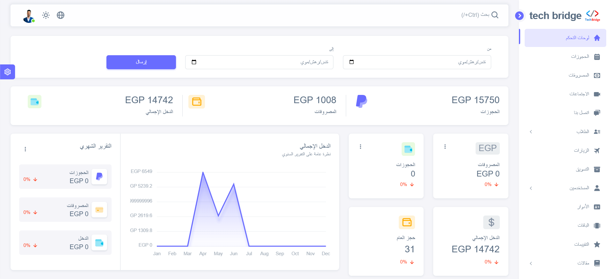

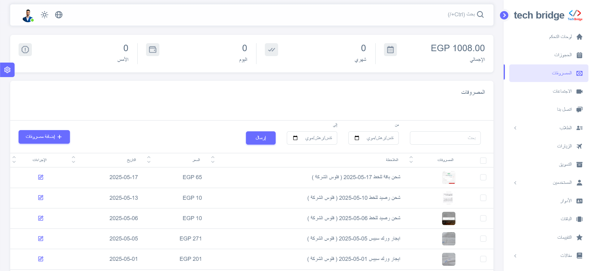
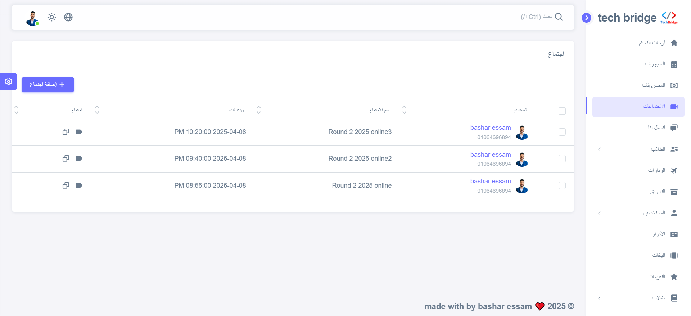
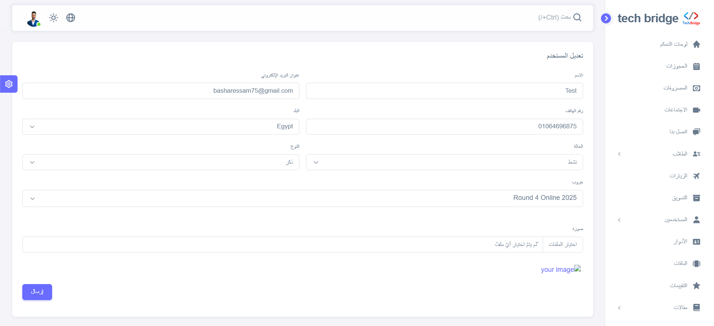
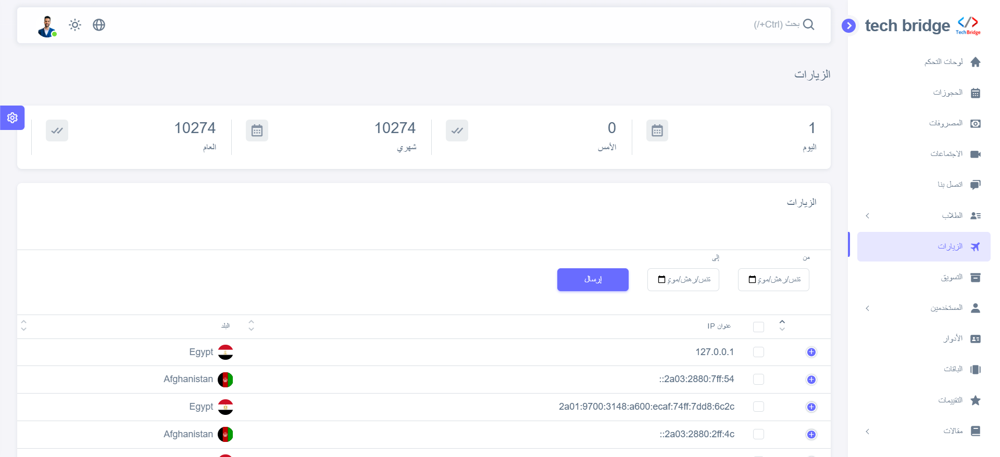
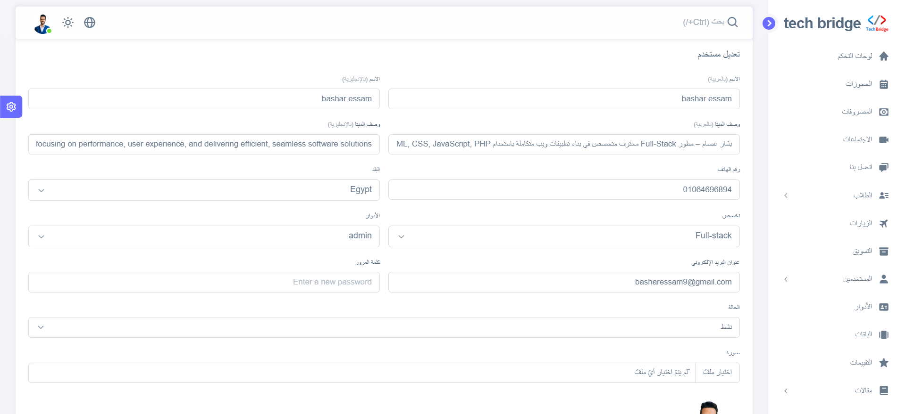
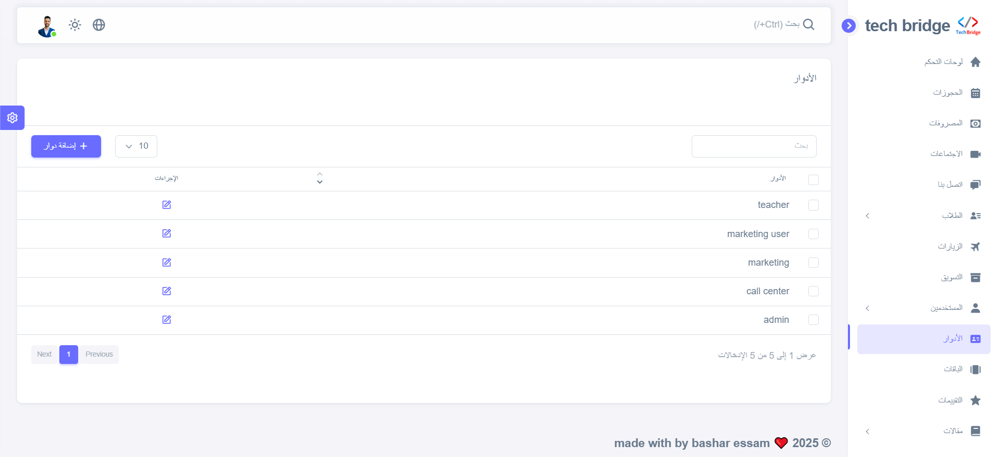
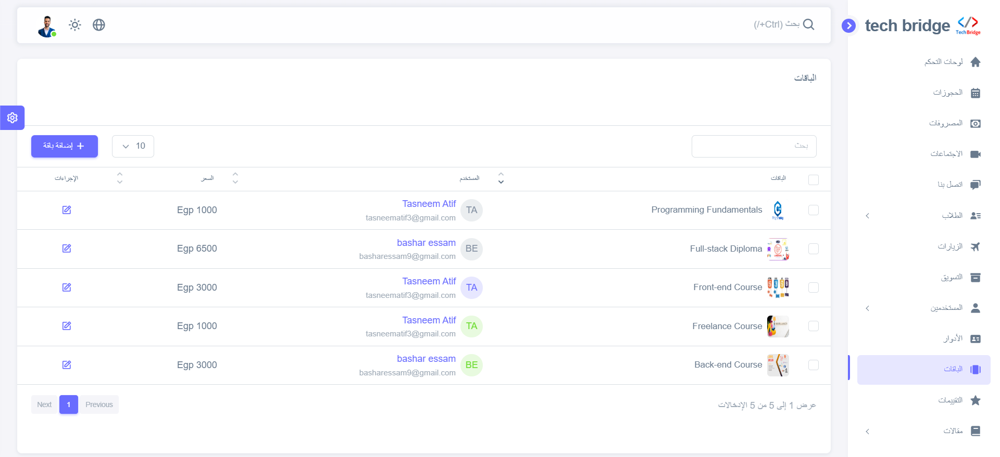
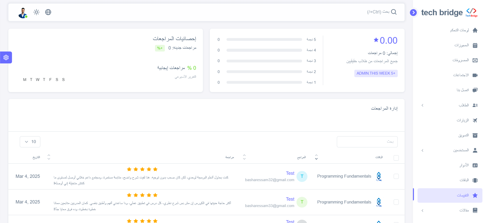
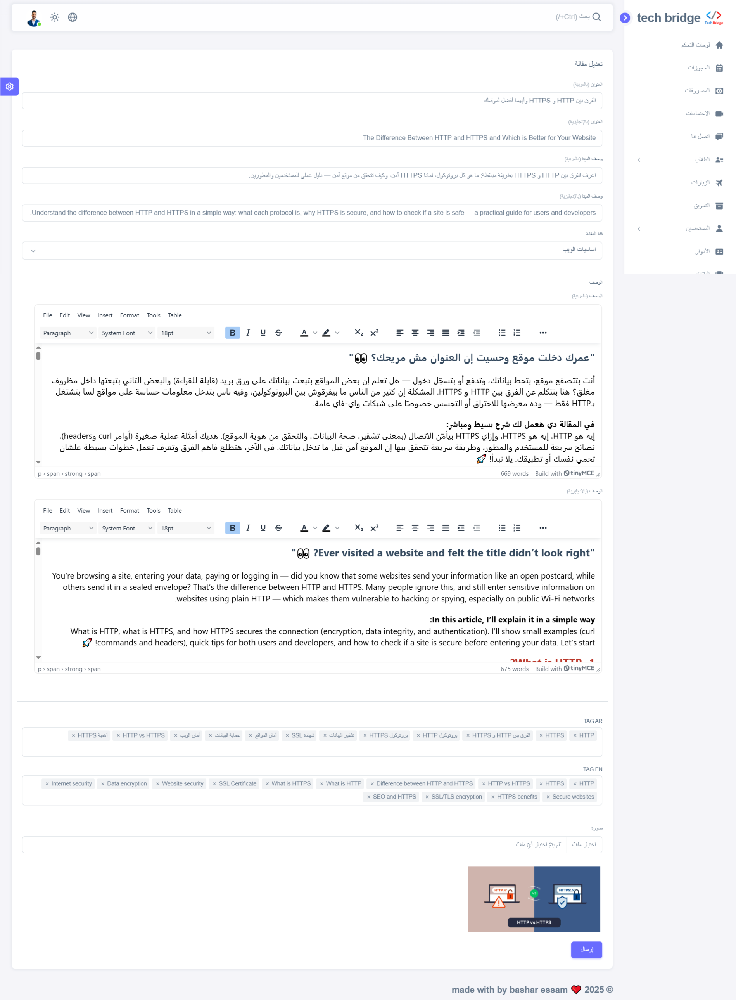
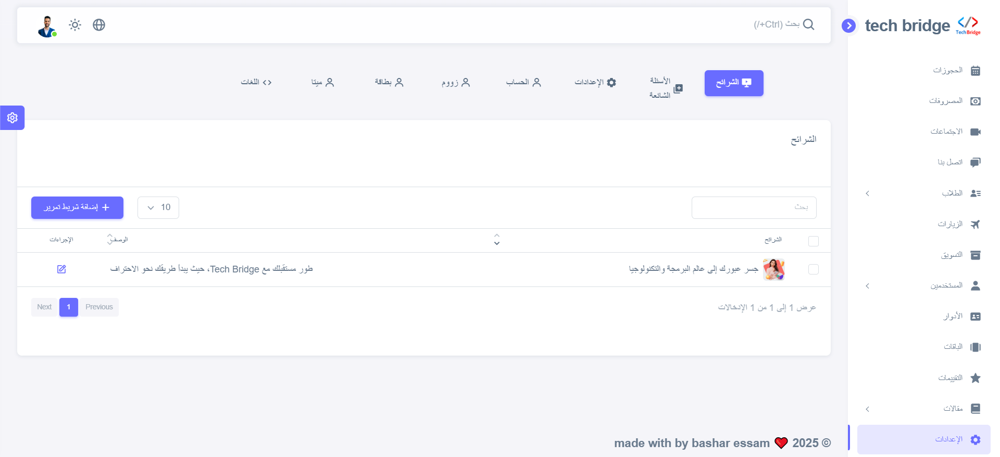
 
